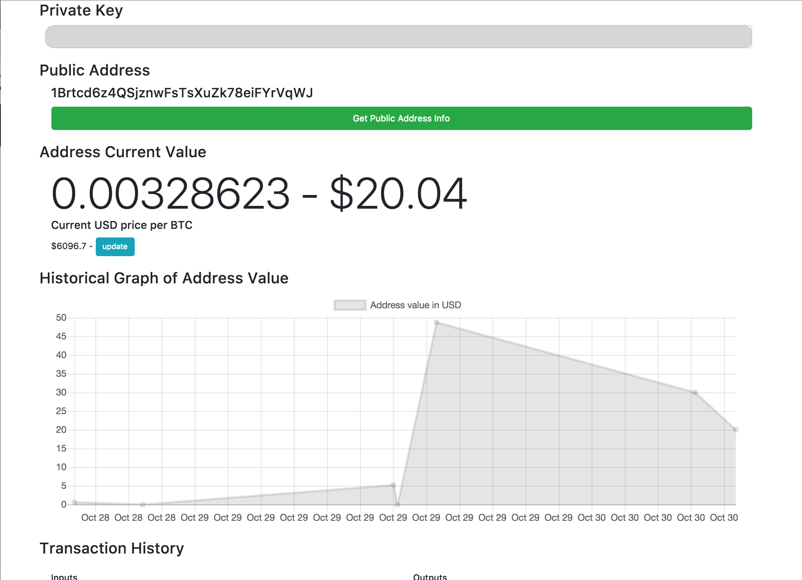
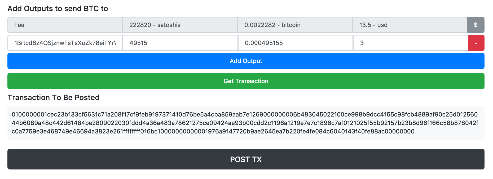

# Moses

### Simple Bitcoin Wallet

Uses `bitcoinjs-lib` and `blockchain.info` API to allow for very basic management of a bitcoin address

#### Enter Private Key and get information on generated Public Address

#### Post Transactions using the Transaction Builder

